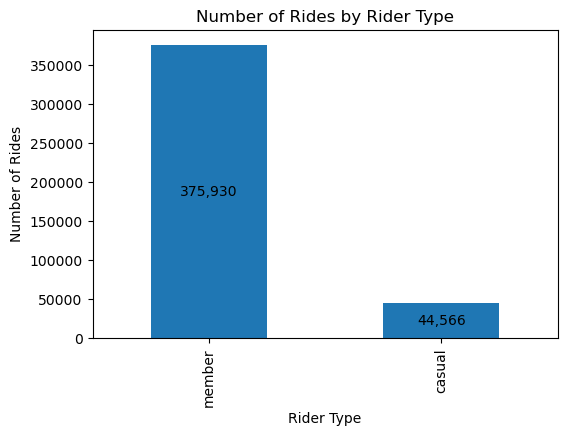
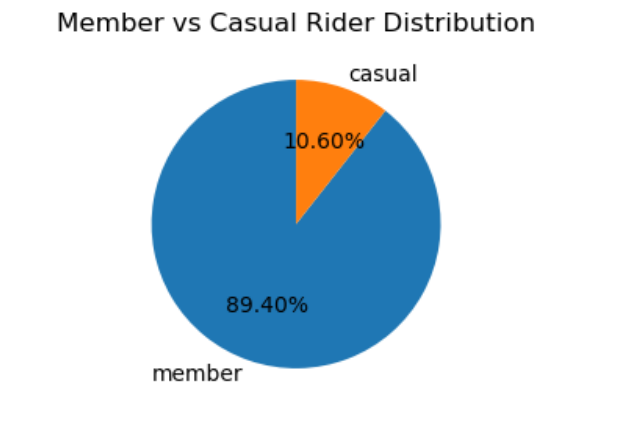
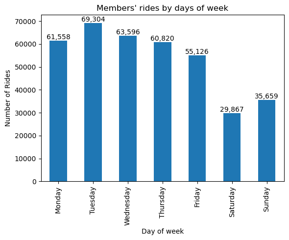

# bike-share-analysis-Q1
Exploratory Data Analysis of Bike Share Trips using Python and Pandas
# Bike Share Analysis Q1

## Project Overview

This project analyzes bike-share trip data using Python and Pandas to identify riding patterns, rider behavior, and peak usage periods.

## Business Task

Understand differences between member and casual riders and identify opportunities to increase memberships.

## Tools Used

- Python
- Pandas
- Matplotlib
- Jupyter Notebook

## Data Cleaning

- Converted date columns to datetime format
- Removed rides with negative and 0 durations
- Removed rides longer than 24 hours

## Analysis Questions

1. Which rider type generates more rides?
2. Which rider type generate higher ride length?
3. Which days are most popular?
4. Which hours have the highest demand?
5. How do members and casual riders differ?

## Key Findings
### 1. Members account for aroung 89% of the rides.
**Recommendation:**
Focus retention campaigns on existing members while converting casual riders.
### Visualization 1: Number of Rides by Rider Type

### Visualization 2: Distribution between member and casul riders

### 2. Members ride mostly during weekdays.
### Visaulization 3: Number of rides by members in each day

### 3.  Peak riding hours for members align with commuting periods.
### Insight
This suggests that most of members are from the workforce who use bikes to commute to their works daily.
**Recommendation:**
Communting periods would be best to perform marketing campaigns targeting at members and off-peak hours are best for performing maintenance service.
### Visualization 4: Number of rides by hour and rider type

## Files

- Bike-share-analysis-Q1.ipynb : Complete analysis notebook

## Author

NYAN LIN
